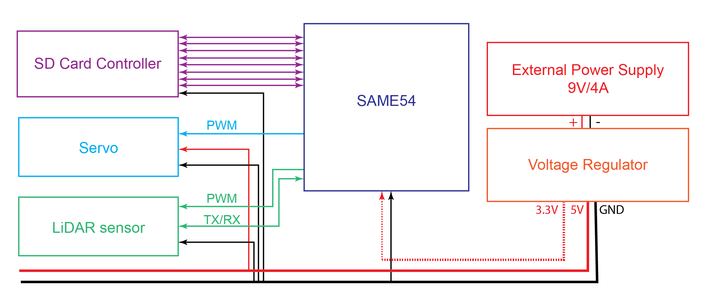

# LAMS 

In these files, you will find the software, datasheets and PCB design for the LAMS project. We integrated multiple peripherals to use with our needed devices such as: timers for the servo PWM signal, UART communications for the LiDAR, simple GPIO signals for a status LED, as well as a simple SysTick configuration to give precise timing measurements. 

## Pinouts

LiDAR: Tx (PA04) / Rx (PA05) / PWM (PB09)  
Servo: PWM (PA07)  
SD Card: CMD (PA20) / CLK (PA21) / DAT0 (PB18) / DAT1 (PB19) / DAT2 (PB20) / DAT3 (PB21) / CD (PD20) / WP (PD21)  
Status LED: PA06  
Start Button: PA27  

## Resources

### SAME54

[SAM D5X/E5X Family Datasheet](http://ww1.microchip.com/downloads/en/DeviceDoc/SAM_D5xE5x_Family_Data_Sheet_DS60001507F.pdf)  
[SAM E54 Xplained Pro User's Guide](http://ww1.microchip.com/downloads/en/DeviceDoc/70005321A.pdf)

### Peripherals

[RPLiDAR A2M8 Datasheet](https://cdn.sparkfun.com/assets/e/a/f/9/8/LD208_SLAMTEC_rplidar_datasheet_A2M8_v1.0_en.pdf)  
[RPLiDAR A2M8 Communications Protocol v1.0](https://www.robotshop.com/media/files/pdf2/rpk-02-communication-protocol.pdf)  
[RPLiDAR A2M8 Communications Protocol v2.1](http://bucket.download.slamtec.com/ccb3c2fc1e66bb00bd4370e208b670217c8b55fa/LR001_SLAMTEC_rplidar_protocol_v2.1_en.pdf)  
[SPT5435-180 Specifications](http://www.spt-servo.com/Product/015234339.html)

### MISC

[ASF4 API Reference Manual](http://ww1.microchip.com/downloads/en/DeviceDoc/50002633B.pdf)
