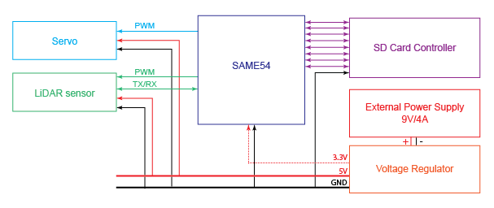

# LAMS 

...description...

## Pinouts

LiDAR: Tx (Pxxx) / Rx (Pxxx) / PWM (Pxxx)

Servo: PWM (PA07)

## Resources

### SAME54

[SAM D5X/E5X Family Datasheet](http://ww1.microchip.com/downloads/en/DeviceDoc/SAM_D5xE5x_Family_Data_Sheet_DS60001507F.pdf)

[SAM E54 Xplained Pro User's Guide](http://ww1.microchip.com/downloads/en/DeviceDoc/70005321A.pdf)

### Peripherals

[RPLiDAR A2M8 Datasheet](https://cdn.sparkfun.com/assets/e/a/f/9/8/LD208_SLAMTEC_rplidar_datasheet_A2M8_v1.0_en.pdf)

[RPLiDAR A2M8 Communications Protocol](https://www.robotshop.com/media/files/pdf2/rpk-02-communication-protocol.pdf)

[SPT5435-180 Specifications](http://www.spt-servo.com/Product/015234339.html)

### MISC

[ASF4 API Reference Manual](http://ww1.microchip.com/downloads/en/DeviceDoc/50002633B.pdf)